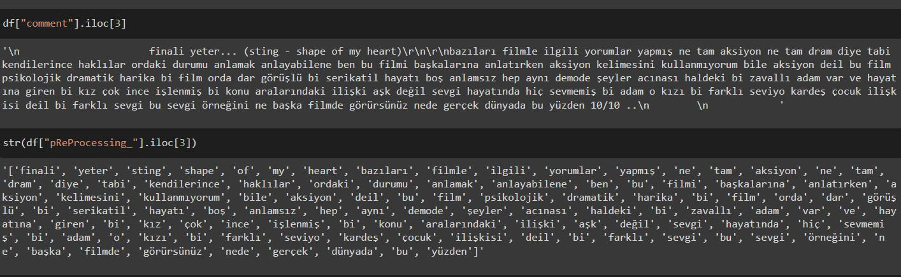
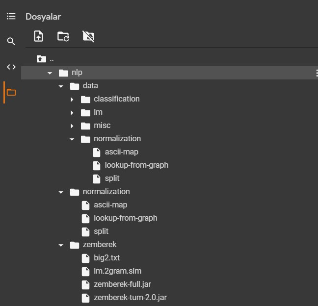
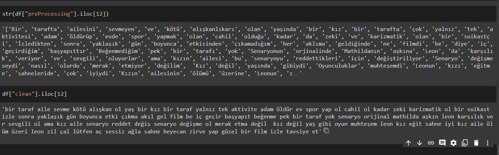
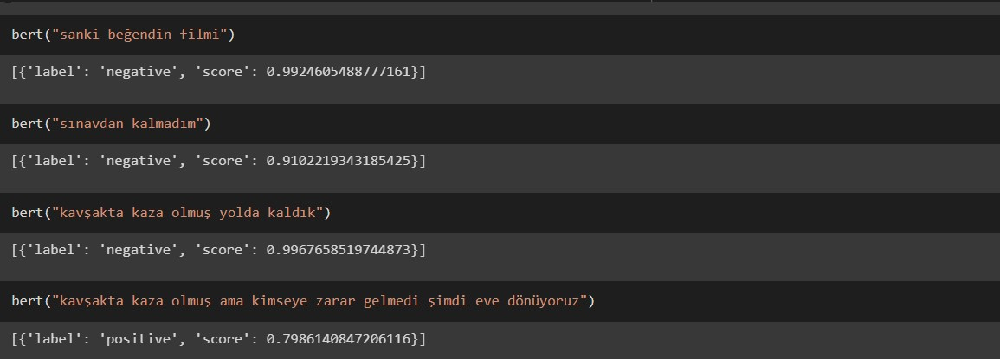

# NLP- Sentiment Analysis

## PreProcessing
Her bir satır aşağıdaki gibi noktalama işaretlerinden, özel karakterlerden temizlendi ve varsa link, mail adresi gibi bağlantılar kaldırıldı.  

## Zemberek
Java ile yazılmış türkçe nlp kütüphanesi olan Zemberek bilgisayarımızdaki JVM(java virtual machine) çalıştırarak ve gerekli dosyaları import edilerek kullanıldı. Bu doslayarı [buradaki linkte](https://drive.google.com/drive/folders/1nvc9FQyHQjGDNj85UgWeGSFhL1b8W4dd?usp=sharing) bulabilirsiniz.
Dosyaların görünümü şu şekilde:

                           
Zemberek java kodu içerisindeki TurkishMorphology, TurkishSpellChecker, TurkishSentenceNormalizer classlarının methodları kullanıldı.
Zemberek sonucundaki çıktı:   
      
       

## Pre-trained Bert
Pre-trained bert modeli import edildikten sonra bazı denemelerin sonuçları  

